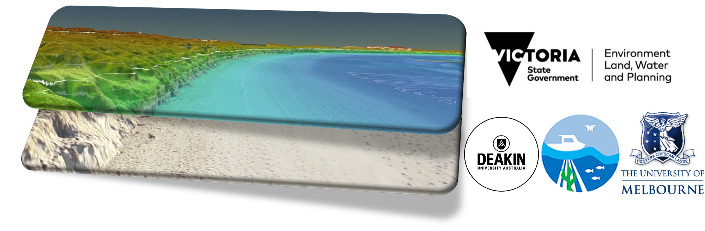

[](https://pypi.python.org/pypi/sandpyper)
[![Contributors][contributors-shield]][contributors-url]
[](https://github.com/npucino/sandpyper/actions/workflows/build.yml/badge.svg)
[](https://github.com/npucino/sandpyper/actions/workflows/docs.yml/badge.svg)
[](https://github.com/npucino/sandpyper/actions/workflows/pypi.yml/badge.svg)
[![Forks][forks-shield]][forks-url]
[![Stargazers][stars-shield]][stars-url]
[![Issues][issues-shield]][issues-url]
[![License][license-shield]][license-url]
[![LinkedIn][linkedin-shield]][linkedin-url]


<!-- PROJECT logo -->
<br />
<p align="center">
  <a href="https://github.com/npucino/sandpyper/">
    
  </a>

  <h1 align="center">Sandpyper</h1>

  <h3 align="center">- Sandy beaches SfM-UAV analysis tools -</h3>

  <p align="justify">
    <em>Sandpyper</em> performs an organised and automated extraction of color and elevation profiles from as many DSM and orthophotos as you like. It is thought to be used when a considerable number of DSMs and orthophotos from many different locations and coordinate reference systems need to be processed.
    Then, it computes volumetric and behavioural analysis of sandy beachfaces, speeding up an otherwise long and difficult to handle job.
    It has some specialised functions to help dealing with the common limitations found in working with Unoccupied Aerial Vehicles (UAVs) and Structure from Motion (SfM) in beach environments, which are:
  <ol>
    <li>Swash zone: the water motion of waves washing in and out of the swash zone prevents SfM algorithm to reliably model elevation. It is commonly discarded.</li>
    <li>Vegetation: both dune vegetation and beach wracks (macroalgae, woody debris) should be removed or filtered as anything that is not sand would compromise sediment volumetric computation and behavioural analysis.</li>
    <li>File size: a few km long beach surveyed with a DJI Phantom 4-Advanced at 100 meters altitude creates roughly 10 Gb (uncompressed) of data, which can be cumbersome for some GIS to handle.</li>
  </ol>

  From user-defined cross-shore transects, <em>Sandpyper</em> helps with:
  <ol>
    <li> cleaning profiles from unwanted non-sand points</li>
    <li> computing period-specific limits of detection to obtain reliable estimates of changes</li>
    <li> detecting statistically significant clusters of change (also referred to hotspots/coldspots) of beach change</li>
    <li> computing multiscale volumetric analysis</li>
    <li> modeling multiscale Beachface Cluster Dynamics indices</li>
    <li> visualising beach changes, limits of detection, transects and BCDs with a variety of in-built plotting methods</li>
  </ol>

  Additionally, <em>Sandpyper</em> has some useful functions that can come at hand, such as:
   automatic transect creation from a vector line, grid creation along a line and subsequent tiles extraction and others.
   <ol>
     <li> automatic transects creation from a vector line </li>
     <li> spatial grid creation of specified tile size along a line </li>
     <li> tiles extraction from spatial grid </li>
   </ol>

  <em>Sandpyper</em> is very easy to use.

  <br>
  
  <br>

  As the above image shows, <em>Sandpyper</em> processing pipeline is mainly composed of **3 main components**:
 <ol>
  <li> Raw data extraction </li>
  <li> Data correction </li>
  <li> Sediment dynamics analysis </li>
 </ol>

  To achieve this in an organised and coherent way, <em>Sandpyper</em> provides two core objects, the ```ProfileSet``` and the ```ProfileDynamics``` classes.
  <br>
  The ```ProfileSet``` class sets up the monitoring global parameters, extracts the change data and Limit of Detections, implements iterative silhouette analysis with inflexion point search and facilitates point cleaning by using user-provided watermasks, shoremasks and class dictionaries.
  <br>
  The ```ProfileDynamics``` class is the core processor for beach dynamics. It computes multitemporal and multiscale elevation change, performs Hotspot/Coldspot analysis at the location level, discretises the data into classes of magnitude of change, models multiscale behavioural dynamics and provides many different plotting options. <br>
  After instantiation, both classes will gradually store more and more beach change information in their attributes.

  Follow the [Jupyter Notebook tutorials](https://github.com/npucino/sandpyper/tree/master/examples) to understand how it works!

  >**This code has supported the analysis and publication of the article ["Citizen science for monitoring seasonal-scale beach erosion and behaviour with aerial drones"](https://rdcu.be/cfgvu  "link to paper"), in the open access Nature Scientific Report journal.**

  <br/>
  <a href="https://npucino.github.io/sandpyper/"><strong>Explore the docs </strong></a>
  »
  <a href="https://github.com/npucino/sandpyper/issues"><strong>Report Bug</strong></a>
  »
  <a href="https://github.com/npucino/sandpyper/issues"><strong>Request Feature</strong></a>
  </p>
</p>


<!-- TABLE OF CONTENTS -->
<details open="open">
  <summary><h2 style="display: inline-block">Table of Contents</h2></summary>
  <ol>
    <li>
      <a href="#about-the-project">About The Project</a>
      <ul>
        <li><a href="#Background">Background</a></li>
        <li><a href="#Modules">Modules</a></li>
      </ul>
    </li>
    <li>
      <a href="#getting-started">Getting Started</a>
      <ul>
        <li><a href="#prerequisites">Prerequisites</a></li>
        <li><a href="#Installation">Installation</a></li>
      </ul>
    </li>
    <li><a href="#usage">Usage</a></li>
    <li><a href="#roadmap">Roadmap</a></li>
    <li><a href="#contributing">Contributing</a></li>
    <li><a href="#license">License</a></li>
    <li><a href="#contact">Contact</a></li>
    <li><a href="#publications">Publications</a></li>
    <li><a href="#acknowledgements">Acknowledgements</a></li>

  </ol>
</details>


<!-- ABOUT THE PROJECT -->
## About The Project



<!-- Background -->
### Background
<em>Sandpyper</em> has been originally developed to facilitate the analysis of a large dataset coming from more than 300 Unoccupied Aerial Vehicles (UAV) surveys, performed by Citizen Scientist in Victoria, Australia. This is the [Eureka Award Winning](https://www.deakin.edu.au/about-deakin/media-releases/articles/eureka-prize-win-for-world-first-citizen-science-program) World-first [beach monitoring program powered by volunteers](https://www.marinemapping.org/vcmp-citizen-science "info on the Citizen Science project"), who autonomously fly UAVs on 15 sensitive sites (erosional hotspots) across the Victorian coast, every 6 weeks for 3 years, since 2018. This project is part of a broader marine mapping program called The [Victorian Coastal Monitoring Program (VCMP)](https://www.marineandcoasts.vic.gov.au/coastal-programs/victorian-coastal-monitoring-program "VCMP website"), funded by the [Victorian Department of Environment, Land, Water and Planning](https://www.delwp.vic.gov.au/ "DELWP website"), co-funded by [Deakin University](https://www.deakin.edu.au/ "Deakin Uni website") and [The University of Melbourne](https://www.unimelb.edu.au/ "UniMelb website").

Each survey creates Digital Surface Models (DSMs) and orthophotos of considerable size (5-10 Gb uncompressed), which can be troublesome for some GIS to render, let alone perform raster-based computations.

<!-- modules -->
### Modules

* **sandpyper**: main module where the ```ProfileSet``` and ```ProfileDynamics``` classes and methods are defined.
* **common**: where all the functions are stored.

<!-- GETTING STARTED -->
## Getting Started

To get a local copy up and running follow these simple steps.

### Prerequisites
* [Install Conda] in your local machine. We need it to create the ```sandpyper_env``` virtual environment.
* then, if you do not have it already, install **Visual Studio C++ build tools** in your local machine, which is needed to install the [richdem](https://pypi.org/project/richdem/ "richdem pypi page") package. You can download it [here](https://visualstudio.microsoft.com/visual-cpp-build-tools/ "standalone VS c++ build tools").
* If you don't have it already, add ```conda-forge``` channel to your anaconda config file, by typing this in your Anaconda Prompt terminal (base environment):
  ```sh
  conda config --add channels conda-forge
  ```
* Now, always in the (base) environment, create a new environment called ```sandpyper_env``` and install the required packages by typing:
  ```sh
  conda create --name sandpyper_env geopandas=0.8.2 matplotlib=3.3.4 numpy=1.20.1 pandas=1.2.2 tqdm pysal=2.1 rasterio=1.2.0 richdem=0.3.4 scikit-image=0.18.1 scikit-learn=0.24.1 scipy=1.6 seaborn=0.11.1 tqdm=4.56.2 fuzzywuzzy
  ```
* If ```rasterio``` package cannot be installed due to __GDAL binding issues__, follow the instructions in [rasterio installation webpage](https://rasterio.readthedocs.io/en/latest/installation.html).

### Installation

1. ```sh
   conda activate sandpyper_env
   ```
2. ```sh
   pip install sandpyper
   ```
2. Install Jupyter Notebooks:
   ```sh
   conda install jupyter notebook
   ```
3. Once you open a Jupyter Notebook with the sandpyper_env, import it to test it works.
   ```sh
   import sandpyper
   ```

<!-- USAGE EXAMPLES -->
## Usage

To see <em>Sandpyper</em> in action, follow the Jupyter Notebooks provided [here](https://github.com/npucino/sandpyper/tree/master/examples).<br>
For the API reference, see the [Documentation](https://npucino.github.io/sandpyper/).

<!-- ROADMAP -->
## Roadmap
<ol>
    <li> Add raster support for Dems of Differences (DoDs) and LoDs.</li>
    <li> Add shoreline analysis from space.</li>
    <li> Add [leafmap](https://github.com/giswqs/leafmap) to better (interactive) plotting.</li>
</ol>

See the [open issues](https://github.com/npucino/sandpyper/issues) for a list of proposed features (and known issues).

<!-- CONTRIBUTING -->
## Contributing

Contributions are what make the open source community such an amazing place to be learn, inspire, and create. Any contributions you make are **greatly appreciated**.

1. Fork the Project
2. Create your Feature Branch (`git checkout -b feature/AmazingFeature`)
3. Commit your Changes (`git commit -m 'Add some AmazingFeature'`)
4. Push to the Branch (`git push origin feature/AmazingFeature`)
5. Open a Pull Request


<!-- LICENSE -->
## License

Distributed under the MIT License. See `LICENSE` for more information.


<!-- CONTACT -->
## Contact

Nicolas Pucino: [@NicolasPucino](https://twitter.com/@NicolasPucino) - npucino@deakin.edu.au
<br>
Project Link: [https://github.com/npucino/sandpyper](https://github.com/npucino/sandpyper)


<!-- Publications -->
## Publications

* [Pucino, N., Kennedy, D. M., Carvalho, R. C., Allan, B. & Ierodiaconou, D. Citizen science for monitoring seasonal-scale beach erosion and behaviour with aerial drones. Sci. Rep. 11, 3935 (2021)](https://rdcu.be/cfgvu)

<!-- ACKNOWLEDGEMENTS -->
## Acknowledgements

* [Funding provided by Deakin University and the Victorian Department of Environment, Land, Water and Planning](https://www.marineandcoasts.vic.gov.au/coastal-programs/victorian-coastal-monitoring-program).
* [Deakin University Citizen Science program webpage](https://www.marinemapping.org/vcmp-citizen-science).
* My PhD supervisor [A/Prof Daniel Ierodiaconou](https://www.deakin.edu.au/about-deakin/people/daniel-ierodiaconou),  and the [Deakin Marine Mapping team](https://www.marinemapping.org/).


<!-- MARKDOWN LINKS & IMAGES -->
<!-- https://www.markdownguide.org/basic-syntax/#reference-style-links -->
[contributors-shield]: https://img.shields.io/github/contributors/npucino/sandpyper.svg?style=image
[contributors-url]: https://github.com/npucino/sandpyper/graphs/contributors
[forks-shield]: https://img.shields.io/github/forks/npucino/sandpyper.svg?style=image
[forks-url]: https://github.com/npucino/sandpyper/network/members
[stars-shield]: https://img.shields.io/github/stars/npucino/sandpyper.svg?style=image
[stars-url]: https://github.com/npucino/sandpyper/stargazers
[issues-shield]: https://img.shields.io/github/issues/npucino/sandpyper.svg?style=image
[issues-url]: https://github.com/npucino/sandpyper/issues
[license-shield]: https://img.shields.io/github/license/npucino/sandpyper.svg?style=image
[license-url]: https://github.com/npucino/sandpyper/blob/master/LICENSE
[linkedin-shield]: https://img.shields.io/badge/-LinkedIn-black.svg?style=image&logo=linkedin&colorB=555
[linkedin-url]: https://www.linkedin.com/in/nicolaspucino/

[Install Conda]:https://www.anaconda.com/products/individual "Anaconda download website"
