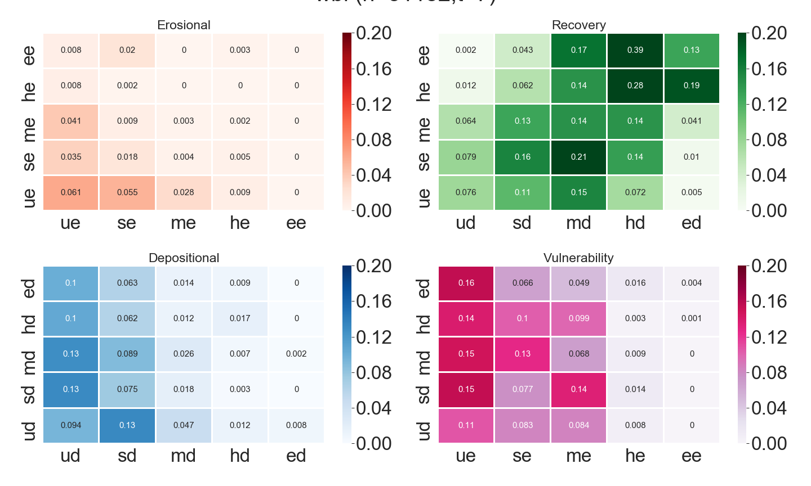

# Beachface Cluster Dynamics indices

The Beachface Cluster Dynamics (BCD) indices are purposefully designed novel metrics to leverage the very high spatiotemporal resolutions and three-dimensionality of UAV SfM topographic data for quantifying subaerial beach morphodynamics. Transition matrices and steady-state probability vectors of Markov chain models representing Δh classes temporal dynamics are used to compute e-BCDs and r-BCD respectively.
The fundamental difference between the two types is that e-BCDs are computed based on dynamics observed over the monitoring period (represented in the transition matrices) while r-BCDs represent what one would expect the sediment budget to be when the same erosional or depositional dynamics are projected over an infinite time steps (steady-state).
Their fact that they contain the terms __beachface cluster__ in their names indicate that BCDs are originally conceived to characterize beachface sediment dynamics of hotspots (technically better named statistically significant clusters) of changes. However, in case of BCDs at transect-level, the scarcity of valid and usable points can lead to the decision to take all the points into account rather than only the hotspots.

Moreover, as the r-BCD to incorporates full 3D profile timeseries, this index can also be seen as a behavioural regime indicator, as it describes what was the underlying tendency of the system during the monitoring period.

## Discrete Markov chain

Following Lambin (1994), a discrete Markov process can be represented as:

$s_{t + 1} = Ms_{t}$

 

where  is a column vector,  having as elements the valid points (within the beachface and beyond LoD sand-only Δh points) in one of the  states (i.e. Δh magnitude classes) at time .  is a  matrix holding the first-order (from  to  transition probabilities  , derived as:

 

where  is the number of transitions from an initial state  to state  and  is the number of states (i.e. elevation change magnitude classes) in which each observation can be. The matrix  is row-standardised, so that the sum of transition probabilities from a given state is always equal to one.

## Empirical Beachface Cluster Dynamics (e-BCDs)
The e-BCDs divide the transition matrix into four sub-matrices, each representing site-level erosional, depositional, recovery and vulnerability “behaviors” of the subaerial beach over the monitoring period (see image below).

 

The e-BCDs indices are computed for every sub-matrices () as follows:

 

where  is the probability of any significant cluster on the sandy beachface to transition from an initial state  to the following state  and  is a weight that reflects the importance (severity) of the transitions in erosion and deposition contexts from a coastal planning perspective (higher weights to worst transitions, such as from Extreme Deposition to Extreme Erosion), which is defined as:

 j } \\ {ws_{i} \times ws_{j} \leftrightarrow i \le j } \\ \end{array} } \right\}," width="258" height="42" /> 

where  and  are the weights related to the initial  and transitioning  states respectively. The brackets “[ ]” indicate that the  transformation is implemented separately to determine the e-BCD sign only. The e-BCD absolute score computation does not implement this multiplication, capturing the process importance only. Any state to either no-hotspot or no-data transition probabilities are not included in the e-BCD interpretation.

## Residual Beachface Cluster Dynamics (r-BCDs)
The r-BCDs are computed from the steady-state probability vector.
The steady-state of a Markov chain returns a unique probability vector representing the states limiting probability distribution, which, once attained, one additional (or more) time steps will return the exact same initial states probabilities, signaling a situation of dynamic equilibrium has been achieved. This is represented as:

 

where    is the vector containing the limiting probabilities  for each   state in  . This vector   is derived by solving a system of m equations with   unknowns, each equation represented as:

 

given that:

The steady-state can be seen in a descriptive way as representing the states hierarchy, which is unique to the system being modelled ([Brown, 1970](http://dx.doi.org/10.2307/143152)), from which we derive the stochastic tendency the system had towards depositional or erosional states at the end of monitoring. We interpret this tendency as the most likely behavioural regime the system was subjected to, given the drivers of change and boundary conditions that influenced its evolution during the monitoring period.

The computation of the r-BCDs is as follows:
 

where   is the steady-state probability distribution of one location,   are the limiting probabilities of the erosional classes (such as undefined erosion, small erosion, medium erosion, high erosion, extreme erosion) and   the limiting probabilities of the depositional classes (undefined deposition, small deposition, medium deposition, high deposition and extreme deposition). The r-BCDs are not signed as no transitions are represented in the resultant vector. Any state to either no-hotspot or no-data transition probabilities are not included in the r-BCD interpretation. The multiplication by 100 is performed for index readability purposes.
